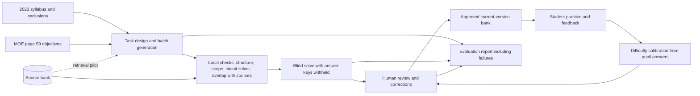

# Capstone PoC — Science Question Studio

[](https://github.com/xl31415926535/Capstone-PoC/actions/workflows/tests.yml)

[中文说明](README.zh-CN.md) · [Validation evidence](VALIDATION.md) · [API and architecture contract](CONTRACT.md) · [Source bank](docs/BANK.md) · [Pilots](docs/PILOT.md)

A local science-question generation and review prototype for the SUTD / SIMCC capstone project. It turns curriculum objectives into reviewable MCQs, checks them against the syllabus, solves their circuit diagrams, compares them with real source questions, keeps validation evidence and failed attempts, and serves approved questions to a separate practice page that calibrates difficulty from pupils' answers.

**Current scope:** Singapore MOE Primary 5 Standard Science, Electrical System: the five page 59 outcomes a written MCQ can assess (circuits as systems, closed circuits, conductors and insulators, circuit diagrams, and batteries and bulbs in series and parallel). The full 2023 primary science syllabus (18 topics, P3 to P6) is loaded for tagging source questions and screening "not required" content. This is an application using existing models, with no newly trained model weights. Questions and labels require human review.

## Quick start: no API key required

Use Node.js 24 for the tested setup (Node.js 22.5 or later is needed for the source bank). There are no third-party package dependencies, so no installation step is needed.

```bash
git clone https://github.com/xl31415926535/Capstone-PoC.git
cd Capstone-PoC
node scripts/start-recorded-demo.mjs
```

Open [the recorded demo](http://127.0.0.1:4319) or [student practice](http://127.0.0.1:4319/practice). Keep the terminal open; press Ctrl+C to stop.

The demo loads **17 saved, unapproved drafts and two historical evaluation reports**, and builds a constructed sample source bank (9 questions written by the team, not real papers). All online providers are disabled. Each launch creates a separate demonstration data directory, so review experiments do not change the main local bank. Saved results are labelled as recorded evidence, not new generation. Use a clearly labelled test identity for simulated review decisions.

The approved bank starts empty. The student page also provides an explicitly unreviewed sample, including a circuit diagram, for exploring the answer-and-feedback flow.

## What to demonstrate

1. Open **Evaluation** to inspect all requested slots, local checks, blind answers, overlap with source questions and concerns. Failed attempts remain visible.
2. Open a question's **Evidence & review** tab to see its learning objectives, task design, provisional difficulty, syllabus screening, circuit solution and validation evidence.
3. Load the circuit examples in Studio (Recorded example) to see a diagram the server draws and solves, and a wrong-key version the solver blocks.
4. Open **Source bank** to search source questions, view their figures and confirm or reject syllabus tags, and **Syllabus coverage** to see sources and drafts per topic and outcome.
5. Record a human approval, request changes or reject a draft. Approval requires four reviewer confirmations and no blocking checks.
6. Correct a learning objective, skill or difficulty with a reason. The old and new labels remain in the event history; a new version invalidates prior approval and model reviews.
7. Practise with approved questions, filtering by learning objective, difficulty and skill. Submit answers to see marks, brief solution steps, distractor explanations and suggested review objectives. Answers to approved questions feed **Pupil responses and difficulty** on the Evaluation page.
8. Export evaluation reports, reviewer feedback, anonymous pupil responses, the approved bank or a printable individual review sheet.

Label corrections require a fresh blind solve before a v2 question can be approved again. The recorded demo disables that online step; use the live workspace when testing the full revision cycle.

## How it works



Five reasoning families are supported: material inference, circuit prediction, fault diagnosis, experimental test selection and claim evaluation. A batch contains 1–10 questions with provisional Easy, Medium or Hard targets.

Each batch makes two model calls: structured generation, then independent solving without the supplied answer key or generator rationale. The blind solve can use a different provider from the generator; same-provider agreement is not cross-provider validation. Missing blind review or answer disagreement blocks approval.

Local checks cover schema, tables, options, answer references, explanation coverage, curriculum source references, the syllabus "not required" notes and similarity within the local corpus. When a question has a circuit diagram, the server solves it (identical ideal batteries and bulbs) and blocks the item if the key disagrees. When a source bank exists, each draft is compared with it, and a near copy of a source question is blocked. Originality rationales are claims to review; text overlap cannot catch a copied idea in new words and is not global originality clearance.

Student practice uses the approved bank and makes no model calls. Answer keys are withheld until submission. A question edited or withdrawn after an attempt begins invalidates that attempt. For approved questions the server keeps each pupil's chosen option, with no name, account or device details, and shows a difficulty band once a question version has 20 answers.

## Live workspace

```bash
node server.mjs
```

On Windows, `./start-local.ps1` can discover the installed official Codex CLI. The teacher workspace runs at [localhost:4317](http://127.0.0.1:4317), and practice at [localhost:4317/practice](http://127.0.0.1:4317/practice).

Configure only the providers you need in the server environment, then restart. The browser does not accept API keys and `.env` files are not automatically loaded.

- **Codex CLI:** use the installed official CLI and existing sign-in. Optional `SIMCC_CODEX_BIN` and `SIMCC_CODEX_MODEL`. Model inference is online and uses the account's Codex allowance. The app does not read or copy authentication tokens.
- **Gemini:** `GEMINI_API_KEY` and `GEMINI_MODEL`.
- **OpenAI API:** `OPENAI_API_KEY` and `OPENAI_MODEL`; separate API access and billing.
- **Jev:** `TYPESAFE_API_KEY`, optionally `JEV_MODEL`; optional text assessment, never automatic human approval.

Codex has been exercised with actual calls. The other adapters have not yet been tested against configured project accounts. There is one active model job at a time, with a six-minute timeout per call. A failed live call is never silently replaced with a recorded question.

To use a source bank, build it into `data/question-bank.sqlite` (or point `SIMCC_BANK_DB` at it); see [docs/BANK.md](docs/BANK.md). `npm run bank:sample` builds the constructed sample. To compare generation with and without source questions, see [docs/PILOT.md](docs/PILOT.md).

## Evidence and tests

```bash
npm test
```

**77 tests** pass locally (Node.js 22.22). Tests use isolated data and mocked providers; they do not consume model quota. GitHub Actions runs the suite on Node.js 24 on Linux and Windows.

Two real batches were run on 29 September 2026, before the syllabus, circuit and source-bank work:

- **Latest batch:** 10 questions stored, 10 local-rule passes, 10/10 blind answers matching the generated keys. Seven questions still had model concerns. All remain unapproved drafts.
- **First batch:** 7 of 10 questions stored. Three were rejected by an overly restrictive mapping schema, since corrected. One stored question had an unresolved ambiguity and failed the blind-answer gate. Its failure remains in the evidence.

This is **not a claim of 100% scientific accuracy**. Human acceptance and review time remain null until actual decisions are recorded. Difficulty has not yet been calibrated with pupils. The CLI did not report its model name, so that field is null. No live run has used retrieval or a second blind-solve provider yet.

See [the complete validation record](VALIDATION.md), [latest evaluation](examples/evaluation-v2.json), [first-run failures](examples/evaluation-v2-first-run.json) and [saved questions](examples/questions-v2.json). The examples contain constructed science questions, not confidential client papers.

## Project layout

- `server.mjs`, `store.mjs`: local HTTP API, versioned records and persistence.
- `model-v2.mjs`, `providers.mjs`: task planning, schemas, prompts and provider adapters.
- `validation.mjs`, `learning.mjs`: validation gates, source overlap, evaluation metrics, practice sessions and difficulty calibration.
- `syllabus.mjs`, `syllabus/`: the 2023 primary science syllabus, exclusion screening and the extraction tooling.
- `circuit.mjs`: circuit figures, drawing, description and solving, shared by the server and both pages.
- `bank.mjs`: the source-question bank (import, tags, flags, search, coverage and retrieval).
- `public/`: teacher and student interfaces.
- `examples/`: saved synthetic questions, real-run evidence, circuit examples and the constructed sample bank.
- `test/`: offline unit and HTTP integration tests.
- `scripts/`: schema generation, the recorded-demo launcher, the bank importer and the retrieval pilot.
- `docs/`: the source bank and the pilots.

Runtime records are written under `data/` (questions, evaluation runs, anonymous pupil responses and the source bank); model job artifacts, pilot reports and recorded-demo copies under `runtime/`. Both are ignored by Git, as are local environment files and logs. `SIMCC_DATA_DIR`, `SIMCC_BANK_DB` and `SIMCC_PORT` can override the live workspace defaults.

## Current limitations

This is a localhost PoC. Teacher/student page separation is not production authentication or role isolation. It does not implement authorised-paper OCR, LearnDash integration, fine-tuning or public hosting. Generation covers the P5 Electrical System pilot only; other topics are tagged and screened, not generated.

The private source bank has 299 questions but only 4 eligible P5 electricity examples for retrieval, and keyword tags still need a teacher's confirmation. Difficulty calibration is built but has no pupil data yet.

The pages were checked by scripted clicks and screenshots in headless Chromium (Studio, Evidence, Evaluation, Source bank, Syllabus coverage and practice), with no console errors; this is not a usability test with teachers or pupils.

Curriculum and assessment references are recorded in [curriculum.json](curriculum.json) and [syllabus/primary-science-2023.json](syllabus/primary-science-2023.json). Questions are not official exam items or endorsed by MOE/SEAB. This repository does not add a software licence or grant rights over client materials; the project team can select an appropriate licence separately.
