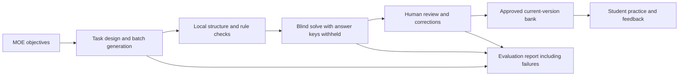

# Capstone PoC — Science Question Studio

[](https://github.com/xl31415926535/Capstone-PoC/actions/workflows/tests.yml)

[中文说明](README.zh-CN.md) · [Validation evidence](VALIDATION.md) · [API and architecture contract](CONTRACT.md)

A local science-question generation and review prototype for the SUTD / SIMCC capstone project. It turns curriculum objectives into reviewable MCQs, retains validation evidence and failed attempts, and serves approved questions to a separate practice interface.

**Current scope:** Singapore MOE Primary 5 Standard Science, closed circuits and electrical conductors/insulators. This is an application using existing models, with no newly trained model weights. Questions and labels require human review.

## Quick start: no API key required

Use Node.js 24 for the tested setup. There are no third-party package dependencies, so no installation step is needed.

```bash
git clone https://github.com/xl31415926535/Capstone-PoC.git
cd Capstone-PoC
node scripts/start-recorded-demo.mjs
```

Open [the recorded demo](http://127.0.0.1:4319) or [student practice](http://127.0.0.1:4319/practice). Keep the terminal open; press Ctrl+C to stop.

The demo loads **17 saved, unapproved drafts and two historical evaluation reports**. All online providers are disabled. Each launch creates a separate demonstration data directory, so review experiments do not change the main local bank. Saved results are labelled as recorded evidence, not new generation. Use a clearly labelled test identity for simulated review decisions.

The approved bank starts empty. The student page also provides an explicitly unreviewed sample for exploring the answer-and-feedback flow.

## What to demonstrate

1. Open **Evaluation** to inspect all requested slots, local checks, blind answers and concerns. Failed attempts remain visible.
2. Open a question's **Evidence & review** tab to see its learning objectives, task design, provisional difficulty and validation evidence.
3. Record a human approval, request changes or reject a draft. Approval requires four reviewer confirmations and no blocking checks.
4. Correct a learning objective, skill or difficulty with a reason. The old and new labels remain in the event history; a new version invalidates prior approval and model reviews.
5. Practise with approved questions, filtering by learning objective, difficulty and skill. Submit answers to see marks, brief solution steps, distractor explanations and suggested review objectives.
6. Export evaluation reports, reviewer feedback, the approved bank or a printable individual review sheet.

Label corrections require a fresh blind solve before a v2 question can be approved again. The recorded demo disables that online step; use the live workspace when testing the full revision cycle.

## How it works



Five reasoning families are supported: material inference, circuit prediction, fault diagnosis, experimental test selection and claim evaluation. A batch contains 1–10 questions with provisional Easy, Medium or Hard targets.

Each batch makes two model calls: structured generation, then independent solving without the supplied answer key or generator rationale. Same-provider agreement is not cross-provider validation. Missing blind review or answer disagreement blocks approval.

Local checks cover schema, tables, options, answer references, explanation coverage, curriculum source references and similarity within the local corpus. Open-form v2 questions do not receive the legacy fixed-circuit Boolean proof. Originality rationales are claims to review; local text overlap is not global originality clearance.

Student practice uses the approved bank and makes no model calls. Answer keys are withheld until submission. A question edited or withdrawn after an attempt begins invalidates that attempt.

## Live workspace

```bash
node server.mjs
```

On Windows, `./start-local.ps1` can discover the installed official Codex CLI. The teacher workspace runs at [localhost:4317](http://127.0.0.1:4317), and practice at [localhost:4317/practice](http://127.0.0.1:4317/practice).

Configure only the providers you need in the server environment, then restart. The browser does not accept API keys and `.env` files are not automatically loaded.

- **Codex CLI:** use the installed official CLI and existing sign-in. Optional `SIMCC_CODEX_BIN` and `SIMCC_CODEX_MODEL`. Model inference is online and uses the account's Codex allowance. The app does not read or copy authentication tokens.
- **Gemini:** `GEMINI_API_KEY` and `GEMINI_MODEL`.
- **OpenAI API:** `OPENAI_API_KEY` and `OPENAI_MODEL`; separate API access and billing.
- **Jev:** `TYPESAFE_API_KEY`, optionally `JEV_MODEL`; optional text assessment, never automatic human approval.

Codex has been exercised with actual calls. The other adapters have not yet been tested against configured project accounts. There is one active model job at a time, with a six-minute timeout per call. A failed live call is never silently replaced with a recorded question.

## Evidence and tests

```bash
npm test
```

The upload was prepared with **36 passing local tests** on Node.js 24. Tests use isolated data and mocked providers; they do not consume model quota. GitHub Actions runs the suite on Linux and Windows.

Two real batches were run on 29 September 2026:

- **Latest batch:** 10 questions stored, 10 local-rule passes, 10/10 blind answers matching the generated keys. Seven questions still had model concerns. All remain unapproved drafts.
- **First batch:** 7 of 10 questions stored. Three were rejected by an overly restrictive mapping schema, since corrected. One stored question had an unresolved ambiguity and failed the blind-answer gate. Its failure remains in the evidence.

This is **not a claim of 100% scientific accuracy**. Human acceptance and review time remain null until actual decisions are recorded. Difficulty has not been calibrated with pupils. The CLI did not report its model name, so that field is null.

See [the complete validation record](VALIDATION.md), [latest evaluation](examples/evaluation-v2.json), [first-run failures](examples/evaluation-v2-first-run.json) and [saved questions](examples/questions-v2.json). The examples contain constructed science questions, not confidential client papers.

## Project layout

- `server.mjs`, `store.mjs`: local HTTP API, versioned records and persistence.
- `model-v2.mjs`, `providers.mjs`: task planning, schemas, prompts and provider adapters.
- `validation.mjs`, `learning.mjs`: validation gates, evaluation metrics and practice sessions.
- `public/`: teacher and student interfaces.
- `examples/`: saved synthetic questions and real-run evidence.
- `test/`: offline unit and HTTP integration tests.
- `scripts/`: schema generation and the isolated recorded-demo launcher.

Runtime records are written under `data/`; model job artifacts and recorded-demo copies under `runtime/`. Both are ignored by Git, as are local environment files and logs. `SIMCC_DATA_DIR` and `SIMCC_PORT` can override the live workspace defaults.

## Current limitations

This is a localhost PoC. Teacher/student page separation is not production authentication or role isolation. It does not implement full P3–secondary coverage, authorised-paper OCR, LearnDash integration, fine-tuning, pupil calibration or public hosting.

The v2 HTTP/API checks passed, but its new screens have not completed visual/click retesting because the browser tool could not verify local-site permissions. Earlier v1 browser checks do not establish that v2 is visually verified.

Curriculum and assessment references are recorded in [curriculum.json](curriculum.json). Questions are not official exam items or endorsed by MOE/SEAB. This repository does not add a software licence or grant rights over client materials; the project team can select an appropriate licence separately.